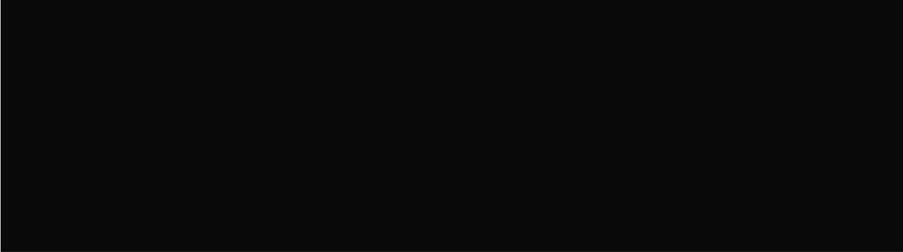

  

<h2 align="center">About</h2>

  
  
  
  

Full stack developer building **fintech products**. At **Poncho Capital** (retail investing) I own the React + TypeScript frontend and work NestJS + GraphQL when the flow needs it — orders, holdings, business rules.

Computer Engineering @ UCASAL · Salta, Argentina. Looking for a **full-remote** product team.

1st place, **Puna Tech 2026** (City Track) with [EstacionaSalta](https://estacionasalta.vercel.app/).

**Languages:** Spanish (native) · English (C1) · Portuguese (B1)

  
  
  

---

### Stack

  

  
  
  
  
  

---

### Selected work

<table>
<tr>
<td width="50%" valign="top">
  <h3><a href="https://estacionasalta.vercel.app/">EstacionaSalta</a></h3>
  
   
  Parking product for Salta. Shipped live in a weekend. City Track winner.
  <a href="https://estacionasalta.vercel.app/">demo</a>
</td>
<td width="50%" valign="top">
  <h3><a href="https://github.com/Jehp23/ink-risk-intelligence">Ink</a></h3>
  
   
  Risk intelligence product UI.
  <a href="https://ink-three-iota.vercel.app">demo</a>
</td>
</tr>
<tr>
<td valign="top">
  <h3><a href="https://github.com/Jehp23/quantlab-front">QuantLab</a></h3>
   
  Markets / quant front-end experiments.
  <a href="https://quantlab2.vercel.app">demo</a>
</td>
<td valign="top">
  <h3><a href="https://github.com/Jehp23/avax-compliance">Cello</a></h3>
   
  Private institutional payments on Avalanche (eERC20).
  <a href="https://cello-avax.vercel.app">demo</a>
</td>
</tr>
<tr>
<td valign="top">
  <h3><a href="https://github.com/Jehp23/InforMed">InforMed</a></h3>
   
  Health information product UI.
  <a href="https://infor-med.vercel.app">demo</a>
</td>
<td></td>
</tr>
</table>

---

  Open to <strong>full-remote</strong> fullstack / product roles in fintech.

