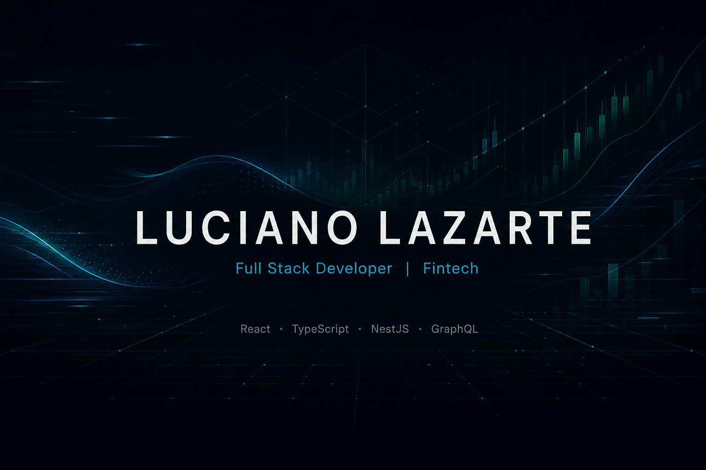
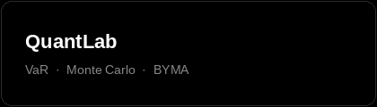

---

### About

Full stack developer building fintech products. Currently at **Poncho Capital** (retail investing): React + TypeScript on the frontend, NestJS + GraphQL on the backend.

Computer Engineering @ UCASAL · Salta, Argentina. Looking for a **full-remote** product team.

1st place, Puna Tech 2026 (City Track) with [EstacionaSalta](https://estacionasalta.vercel.app/).

**Languages:** Spanish (native) · English (C1) · Portuguese (B1)

---

### Stack

---

### Selected work

| Project | Live |
| :--- | :--- |
| [Ink](https://github.com/Jehp23/ink-risk-intelligence) | [demo](https://ink-three-iota.vercel.app) |
| [QuantLab](https://github.com/Jehp23/quantlab-front) | [demo](https://quantlab2.vercel.app) |
| [Cello](https://github.com/Jehp23/avax-compliance) | [demo](https://cello-avax.vercel.app) |
| [InforMed](https://github.com/Jehp23/InforMed) | [demo](https://infor-med.vercel.app) |
| [EstacionaSalta](https://estacionasalta.vercel.app/) · 1st, City Track | [demo](https://estacionasalta.vercel.app) |

---

<i>Open to full-remote fullstack / product roles in fintech.</i>

